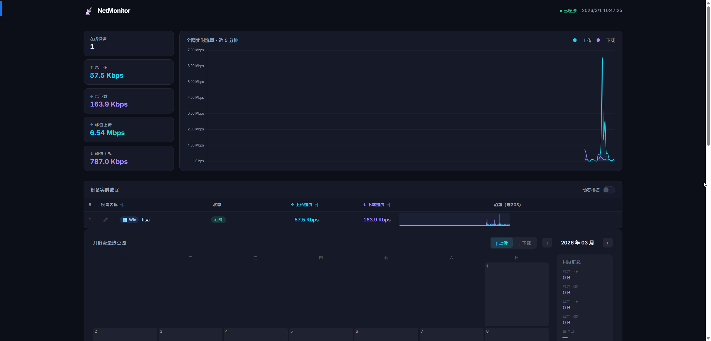
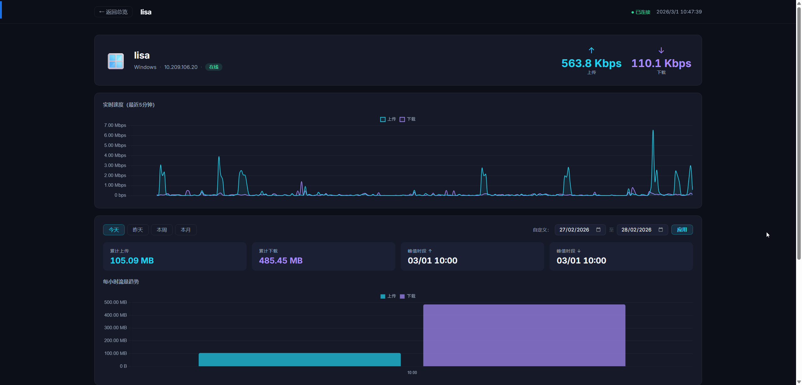

# NetMonitor — 家用网络监控系统

> 实时监控家里的设备（电脑）的上传/下载速度，网页端可视化，支持 Windows 和 macOS。
> 客户端通过系统托盘（状态栏）运行，支持开机自启，自动在局域网内发现监控服务端。

  
  
   <i>NetMonitor 仪表盘概览</i>

## 下载与安装

目前提供了免安装依赖的一键安装包，请前往项目仓库的 **[Releases](https://github.com/secure-artifacts/networkhome/releases)** 页面下载最新版本。

### 1. 服务端 Server (监控中心)
> **建议安装在一台长期开机的 Windows 电脑或其他核心设备上**

- **下载与安装**：下载发布页的 `NetMonitor-Server-Setup.exe` 并安装。
- **运行方式**：安装完成后，服务端会自动在**系统托盘**（桌面右下角）静默运行。
- **基本操作与设置**：右键点击托盘中的 🌐 图标，可以选择：
  - `打开监控面板`：在浏览器中打开监控网页（默认地址 `http://localhost:8866`）。
  - `复制访问地址`：方便您发送给手机、平板或其他设备，在局域网内任意浏览器查看。
  - `退出服务器`：关闭并退出整个监控系统后端。

### 2. 客户端 Agent (被监控设备)
> **需要在您希望监控网速的每一台电脑上安装**

- **下载与安装**：
  - **Windows 电脑**：下载发布页的 `NetMonitor-Agent-Setup.exe` 并安装。
  - **macOS 电脑**：根据您的芯片类型，下载相应的 DMG 文件（`NetMonitor-Agent-Mac.dmg` 为 M系列芯片，`NetMonitor-Agent-Mac-Intel.dmg` 为老款英特尔芯片），双击打开并将程序拖入 `Applications (应用程序)` 文件夹中运行。
- **配置与使用**：
  - 客户端启动后同样会驻留在系统的**任务栏托盘**（macOS 则在屏幕最顶部的状态栏）。
  - **自动发现**：客户端自带基于 UDP 广播的局域网自动发现功能，通常**不需要手动配置服务端地址**，它会自己找到 Server。
  - **手动设置服务器**：如果是跨网段（如虚拟机与宿主机、不同路由子网）等无法广播的情况，请右键托盘图标选择 `设置服务器` 手动输入服务器的 IP 或地址（例如 `http://192.168.1.100:8866`）。
  - **主机别名设置**：右键托盘图标选择 `设置别名`，可为当前的这台设备起一个好记的名字（如“书房电脑”、“MacBook”，不设置则默认使用机器名）。
  - **开机自启**：Windows 下的安装包在安装时会自动配置了开机启动，确保网络情况绝不错漏。

---

## 监控大屏 (查看说明)

通过内网浏览器访问服务端地址（如 `http://服务端局域网IP:8866`），即可进入可视化数据大屏：

- **仪表盘总览**：首页实时展示所有已连接在线客户端（设备卡片）的当前上传、下载速度总和，以及离线设备列表。左上角的大字滚动播报当前家庭总流量。
- **设备详情页**：点击首页某个具体的设备卡片，即可进入该设备的详细历史流量监控页。
- **数据与图表查看**：
  - **实时动态图**：每秒刷新一次，借助 WebSocket 技术实现服务端到网页的零延迟双向推送。
  - **历史折线图**：支持查看近 5分钟 - 近 30天内的上传下载速度历史。您可以滑动日期选择器自由框选感兴趣的时间段细究。
  - **24小时热力日历表**：直观展示该设备在过去一个月中，每天的哪个小时用网最活跃、数据交换最拥挤。
  
---

## 安全与隐私

- **纯局域网设计**：本软件设计初衷为个人局域网完全掌控，所有数据（含详细的流量时序记录）全部极简存储在本地机器（SQLite 数据库），不依赖也不能通过任何外网云服务，彻底保护隐私。
- **软件源防篡改验证**：在 GitHub 的 Release 发行版中，所有安装包皆由 GitHub Actions 提供全自动化打包，并已全部附带 GitHub 官方颁发的 **Build Attestation (构建证明)**，确保您下载的软件二进制文件安全源于本开源仓库，100% 透明。
